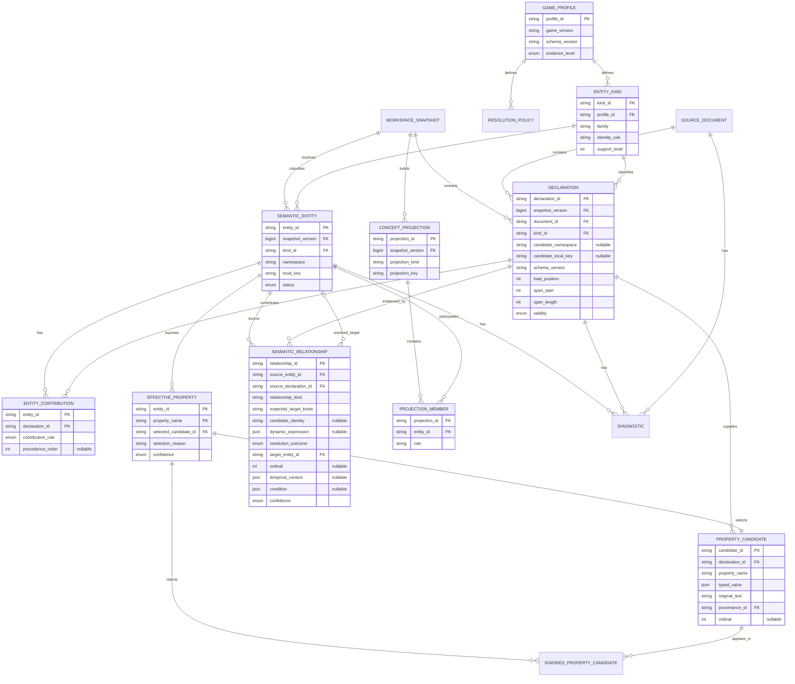
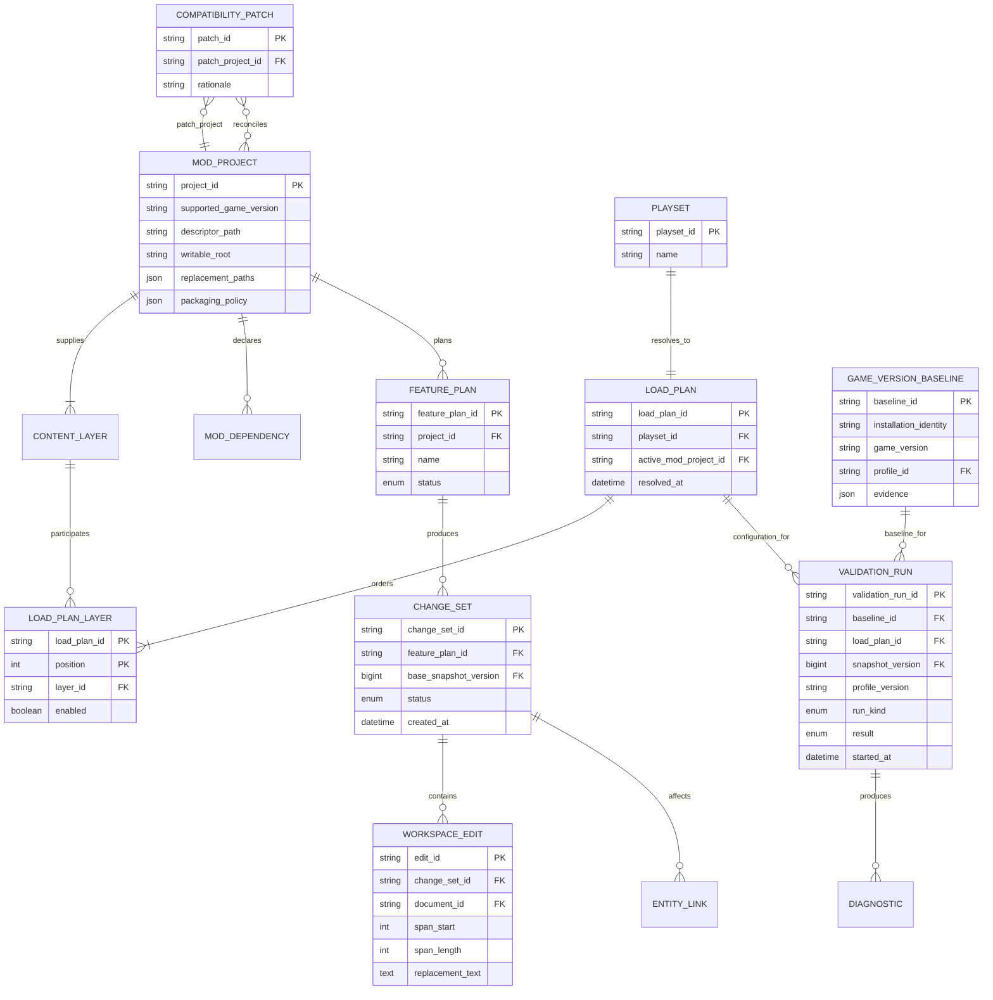

# ERD reference

## Purpose and scope

This document turns Oxide's architecture documentation and implemented model into an
ERD-ready logical specification. Oxide does not currently use a relational database:
game content is persisted as source files, while declarations, semantic entities,
references, diagnostics, and projections are immutable, reproducible indexes. The
tables below are therefore a logical relational projection, useful for communicating
identity, ownership, cardinality, and future storage or query design.

The source of truth is split into two scopes:

- **Implemented slice**: types currently present in `Oxide.Core`.
- **Target domain**: entity and authoring kinds named in the architecture documents,
  especially `08-domain-model.md`.

Do not model a concept projection as a game entity, or an effective property as if it
were the original source. Provenance and declarations must remain independently
addressable.

## Core modeling rules

1. `EntityId = (kind, namespace, local_key)` is the semantic primary key. Display
   names and localisation are not identity.
2. A physical file is a `SourceDocument`; a meaningful contribution extracted from it
   is a `Declaration`; the resolved identity is a `SemanticEntity`; a user-oriented
   composition is a `ConceptProjection`.
3. Documents are persistent game content. Declarations, entities, relationships, and
   projections are derived per immutable workspace snapshot.
4. One entity can have many declarations. Duplicate declarations may merge, replace,
   coexist, conflict, or remain unresolved according to a versioned policy.
5. Relationships are directional records with their own provenance and resolution
   result, not direct object pointers.
6. Every selected effective value retains its selected provenance, ignored candidates,
   and selection reason.
7. Physical paths and virtual paths are different attributes. A virtual path is unique
   only within a content layer.
8. Historical, conditional, inferred, and runtime-possible facts must not be collapsed
   into unconditional relationships.

## Implemented logical ERD

```mermaid
erDiagram
    WORKSPACE_SNAPSHOT ||--|{ CONTENT_LAYER : contains
    WORKSPACE_SNAPSHOT ||--o{ SOURCE_DOCUMENT : indexes
    WORKSPACE_SNAPSHOT ||--|| SEMANTIC_SNAPSHOT : derives
    CONTENT_LAYER ||--o{ SOURCE_DOCUMENT : owns
    SOURCE_DOCUMENT ||--o{ STATE_DECLARATION : contains
    SOURCE_DOCUMENT ||--o{ COUNTRY_TAG_DECLARATION : contains
    SOURCE_DOCUMENT ||--o{ STRATEGIC_REGION_DECLARATION : contains
    SOURCE_DOCUMENT ||--o{ LOCALISATION_DECLARATION : contains
    LOCALISATION_ENTRY ||--|{ LOCALISATION_DECLARATION : contributions
    STATE_ENTITY ||--|{ STATE_DECLARATION : contributions
    COUNTRY_ENTITY ||--|{ COUNTRY_TAG_DECLARATION : contributions
    STRATEGIC_REGION_ENTITY ||--|{ STRATEGIC_REGION_DECLARATION : contributions
    STATE_ENTITY ||--o{ STATE_RESOURCE : has
    STATE_ENTITY ||--o{ STATE_PROVINCE : contains
    STRATEGIC_REGION_ENTITY ||--o{ REGION_PROVINCE_CLAIM : contains
    STATE_ENTITY ||--|| STATE_REGION_MEMBERSHIP : derives
    STATE_REGION_MEMBERSHIP ||--o{ PROVINCE_REGION_REFERENCE : explains
    PROVINCE_REGION_REFERENCE }o--o{ REGION_PROVINCE_CLAIM : resolves_against
    STATE_ENTITY ||--o| COUNTRY_REFERENCE : owner
    STATE_ENTITY ||--o{ COUNTRY_REFERENCE : core
    COUNTRY_REFERENCE }o--o| COUNTRY_ENTITY : resolves_to
    STATE_ENTITY ||--o{ SEMANTIC_DIAGNOSTIC : reports
    COUNTRY_ENTITY ||--o{ SEMANTIC_DIAGNOSTIC : reports
    SOURCE_DOCUMENT ||--o{ WORKSPACE_DIAGNOSTIC : reports
    SOURCE_DOCUMENT ||--o{ SOURCE_PROVENANCE : locates
    STATE_DECLARATION ||--o{ SOURCE_PROVENANCE : values_from
    COUNTRY_TAG_DECLARATION ||--o{ SOURCE_PROVENANCE : values_from
    LOCALISATION_DECLARATION ||--o{ SOURCE_PROVENANCE : values_from

    WORKSPACE_SNAPSHOT {
        bigint version PK
        datetime loaded_at
        string display_name
        string game_root
        string active_mod_root "nullable"
    }
    CONTENT_LAYER {
        string layer_id PK
        bigint snapshot_version FK
        enum kind
        string root_path
        int position
        boolean is_writable
    }
    SOURCE_DOCUMENT {
        string document_id PK
        string layer_id FK
        string virtual_path
        string physical_path
        enum load_status
        enum contribution_status
        text source_text "nullable"
        json syntax_tree "nullable"
    }
    SEMANTIC_SNAPSHOT {
        bigint snapshot_version PK
    }
    STATE_DECLARATION {
        string declaration_id PK
        string document_id FK
        int state_id "nullable"
        json candidate_values
        int span_start
        int span_length
    }
    COUNTRY_TAG_DECLARATION {
        string declaration_id PK
        string document_id FK
        string original_tag
        string normalized_tag
        string definition_path
        int span_start
        int span_length
    }
    STRATEGIC_REGION_DECLARATION {
        string declaration_id PK
        string document_id FK
        int strategic_region_id "nullable"
        json name_candidates
        json province_candidates
        int span_start
        int span_length
    }
    LOCALISATION_DECLARATION {
        string declaration_id PK
        string document_id FK
        string language
        string localisation_key
        int version "nullable"
        string value
        int span_start
        int span_length
    }
    LOCALISATION_ENTRY {
        string language PK
        string localisation_key PK
        enum resolution_status
    }
    STATE_ENTITY {
        string entity_id PK
        bigint snapshot_version FK
        int state_id UK
        enum status
        string name "nullable"
        bigint manpower "nullable"
        string state_category "nullable"
    }
    COUNTRY_ENTITY {
        string entity_id PK
        bigint snapshot_version FK
        string normalized_tag UK
        enum status
        string definition_path "nullable"
    }
    STRATEGIC_REGION_ENTITY {
        string entity_id PK
        bigint snapshot_version FK
        int strategic_region_id UK
        enum status
        string name "nullable"
    }
    STATE_RESOURCE {
        string state_entity_id PK
        string resource_name PK
        decimal amount
        string provenance_id FK
    }
    STATE_PROVINCE {
        string state_entity_id PK
        int ordinal PK
        int province_id
        string provenance_id FK
    }
    REGION_PROVINCE_CLAIM {
        string strategic_region_entity_id PK
        int ordinal PK
        int province_id
        string provenance_id FK
    }
    STATE_REGION_MEMBERSHIP {
        string state_entity_id PK
        enum outcome
        int resolved_count
        int missing_count
        int ambiguous_count
    }
    PROVINCE_REGION_REFERENCE {
        string state_entity_id PK
        int state_province_ordinal PK
        int province_id
        enum outcome
        string state_provenance_id FK
    }
    COUNTRY_REFERENCE {
        string reference_id PK
        string state_entity_id FK
        enum role
        string original_tag
        enum outcome
        string target_country_id FK "nullable"
        string candidate_tag "nullable"
        string reason "nullable"
        string provenance_id FK
    }
    SOURCE_PROVENANCE {
        string provenance_id PK
        string document_id FK
        string layer_id FK
        string physical_path
        int span_start
        int span_length
    }
    SEMANTIC_DIAGNOSTIC {
        string diagnostic_id PK
        bigint snapshot_version FK
        string entity_id FK "nullable"
        string provenance_id FK "nullable"
        string code
        enum severity
        string message
    }
    WORKSPACE_DIAGNOSTIC {
        string diagnostic_id PK
        bigint snapshot_version FK
        string document_id FK "nullable"
        string physical_path "nullable"
        int span_start "nullable"
        int span_length "nullable"
        string code
        enum severity
        string message
    }
```

Standalone chart source: [`diagrams/implemented-logical-erd.mmd`](diagrams/implemented-logical-erd.mmd).

### Implemented entity and record catalogue

| Logical record | Key | Important fields | Cardinality / notes |
|---|---|---|---|
| `WorkspaceConfiguration` | embedded in snapshot | `game_root`, optional `active_mod_root`, `display_name` | One configuration per snapshot. |
| `WorkspaceSnapshot` | `version` | `loaded_at`, documents, layers, diagnostics, semantics, load metrics | One published immutable version; indexes are derived. |
| `ContentLayer` | `layer_id` within snapshot | `kind`, `root_path`, `position`, `is_writable` | Snapshot has one or more; implementation supports base game and optional active mod. |
| `SourceDocument` | SHA-256 `document_id` from layer ID + virtual path | physical/virtual paths, load and contribution status, text, syntax tree | Layer has zero or many documents. Same virtual path may occur in many layers. |
| `StateDeclaration` | no implemented standalone ID | document, complete provenance, ID/name/manpower/category/resource/province/owner/core candidates | Document has zero or many; entity has one or many contributions. A database projection should add `declaration_id`. |
| `CountryTagDeclaration` | no implemented standalone ID | document, original and normalized tag, definition path, provenance | Same ID recommendation as above. |
| `StrategicRegionDeclaration` | no implemented standalone ID | document, ID/name candidates, ordered sourced province claims, declaration provenance | Invalid declarations remain inspectable; valid IDs contribute to a typed region. |
| `LocalisationDeclaration` | no implemented standalone ID | language, case-sensitive key, optional version, sourced value, declaration provenance | Every duplicate remains a contribution to its language-qualified entry. |
| `ContributionResolution<T>` | semantic identity | policy, outcome kind, classified contributions | Shared immutable result for states, countries, regions, and localisation; losing candidates remain queryable. |
| `ResolvedContribution<T>` | contribution ordinal | declaration, layer, disposition, reason | Disposition is effective, shadowed, ambiguous, invalid, or excluded. |
| `LocalisationEntry` | `(language, localisation_key)` | immutable declaration contributions and shared resolution | Higher participating layers override lower layers; same-layer valid duplicates remain ambiguous. |
| `LocalisationResolution` | requested language and key | resolved, missing, ambiguous, or invalid payload and reference chain | English fallback is attempted only after an exact-language miss and performs its own layer resolution. |
| `EntityId` | `(kind, namespace, local_key)` | typed canonical identity | Current kinds: `State`, `Country`, `StrategicRegion`. Numeric identities use `global`; country uses `tag`. |
| `StateEntity` | `EntityId` | status, effective name/manpower/category/resources/provinces, owner and core references | Derived per semantic snapshot. |
| `CountryEntity` | `EntityId` | status, effective definition path | Derived per semantic snapshot. |
| `StrategicRegionEntity` | `EntityId` | status, contribution resolution, effective name, ordered effective province claims | Cross-layer overrides resolve; same-layer duplicates retain all contributions and remain ambiguous. |
| `ProvinceStrategicRegionIndex` | province ID | every `ProvinceStrategicRegionCandidate` | Immutable snapshot lookup; repeated same-region claims remain resolved, competing/ambiguous identities remain ambiguous. |
| `StateStrategicRegionMembership` | state numeric ID | status, province references, resolved regions, diagnostics | Outcomes are single, split, partial, missing, ambiguous, or no-provinces. |
| `ProvinceStrategicRegionReference` | state province occurrence | state-side effective value plus resolved/missing/ambiguous outcome | Resolved and ambiguous outcomes retain every region-side candidate provenance. |
| `CountryReference` | no implemented standalone ID | original tag, provenance, resolution | Belongs to a state as either owner or core; add `reference_id` and `role` in a relational projection. |
| `CountryResolution` | subtype of reference | resolved, missing, ambiguous, or invalid payload | Exactly one outcome per country reference. |
| `SourceProvenance` | no implemented standalone ID | document, physical path, layer, text span | Repeated throughout sourced/effective values and diagnostics; add `provenance_id` if normalized. |
| `SourcedValue<T>` | value occurrence | typed value, original text, provenance | Represents one candidate, not necessarily the effective value. |
| `NamedSourcedValue<T>` | `(name, occurrence)` | name + sourced value | Used for state resources. |
| `EffectiveValue<T>` | property occurrence | selected value/provenance/reason, ignored candidate provenance | Exists only when a value can be selected unambiguously. |
| `SemanticDiagnostic` | no implemented standalone ID | code, severity, message, optional entity/provenance, related provenance | Snapshot has many; entity association is optional. |
| `WorkspaceDiagnostic` | no implemented standalone ID | code, severity, message, optional path/document/span | Snapshot has many; document association is optional. |
| `WorkspaceLoadMetrics` | snapshot version | counts and timings | Exactly one per snapshot; operational, not game-domain data. |

### Implemented constraints and enums

- `Country` tag: exactly three ASCII letters or digits; lookup is uppercase.
- `State` local key: integer scalar; exactly one ID candidate is needed for a typed
  identity.
- `SemanticEntityStatus`: `Effective`, `Ambiguous`, `Invalid`, `Missing`.
- `ContentLayerKind`: `BaseGame`, `Mod`.
- `DocumentLoadStatus`: `Loaded`, `Failed`.
- `DocumentParticipationKind`: `Participating`, `ShadowedByHigherLayerPath`,
  `ExcludedByReplacementPath`.
- `ContributionDisposition`: `Effective`, `Shadowed`, `Ambiguous`, `Invalid`,
  `Excluded`.
- `CountryResolution`: `ResolvedCountry`, `MissingCountry`, `AmbiguousCountry`,
  `InvalidCountry`.
- `LocalisationResolution`: `ResolvedLocalisation`, `MissingLocalisation`,
  `AmbiguousLocalisation`; invalid input returns `InvalidLocalisation`.
- A state gets an effective declaration when layered resolution finds one valid
  winner; every lower-layer or excluded contribution remains attached.
- Effective scalar properties require exactly one candidate. Duplicate resources do
  not receive an effective value. Owner is optional and is resolved only when there is
  one owner candidate. Cores are multi-valued.
- Current owner/core extraction only sees immediate properties in the initial
  `history` block; it excludes dated and scripted changes.

## Target generic semantic ERD

This normalized core can represent all future entity kinds without creating a table
for every registry. Typed extension tables may be added for high-value domains.

### Generic relationship resolution outcomes

| Outcome | Target FK | Required payload |
|---|---:|---|
| `Resolved` | required | resolved entity identity |
| `Missing` | null | candidate key |
| `Ambiguous` | null | candidate set and reason |
| `Dynamic` | null | expression and constraints |
| `Invalid` | null | reason |
| `NotApplicable` | null | optional explanation |

Ambiguous candidates should use a child table
`RelationshipCandidate(relationship_id, candidate_entity_id, ordinal)` rather than a
JSON array if candidate querying matters.

## Target game entity catalogue

All of the following are semantic entity kinds named by the documentation. Families
are organizational only; they are not identities.

| Family | Entity kinds |
|---|---|
| World and geography | `Province`, `State`, `StrategicRegion`, `SupplyNode`, `Railway`, `MapAdjacency` |
| Countries and politics | `Country`, `CountryHistory`, `Character`, `Ideology`, `SubIdeology`, `CountryLeaderTrait`, `UnitLeaderTrait`, `Idea`, `IdeaCategory`, `Decision`, `DecisionCategory`, `BalanceOfPower`, `AutonomyState` |
| Diplomacy and world rules | `Faction`, `WarGoal`, `OpinionModifier`, `ScriptedDiplomaticAction`, `GameRule`, `DifficultySetting`, `Bookmark`, `OccupationLaw`, resistance/compliance definitions, peace-conference behavior definitions |
| Narrative and progression | `Event`, `FocusTree`, `NationalFocus`, `Technology`, `Doctrine`, `ContinuousFocus`, `SpecialProject`, `Specialization`, `ScientistTrait`, `Achievement` |
| Military and economy | `UnitType`, `SubUnit`, `DivisionTemplate`, `OrderOfBattle`, `Equipment`, `EquipmentVariant`, `EquipmentArchetype`, `Building`, `Resource`, `Modifier`, `ModifierDefinition`, `MilitaryIndustrialOrganization`, MIO policy, MIO trait, `Ability`, `Medal`, `Ace`, `RaidType` |
| Intelligence and operations | `IntelligenceAgency`, `IntelligenceAgencyUpgrade`, operative registries, `Operation`, `OperationPhase`, `OperationToken`, `TimedActivity` |
| AI configuration | `AIStrategy`, `AIStrategyPlan`, `AIFocus`, `AITemplate`, equipment/naval/area/theatre AI configuration |
| Script and runtime symbols | `ScriptedEffect`, `ScriptedTrigger`, `ScriptedModifier`, `ScriptedValue`, `OnAction`, `ScriptedLocalisation`, `ScriptConstant`, `ScriptCollection`, `MeanTimeToHappen`, `Variable`, `Flag`, `EventTarget`, `ScopeExpression` |
| Presentation and assets | `LocalisationEntry`, `Sprite`, `Portrait`, `Texture`, `Sound`, `MusicTrack`, `RadioStation`, `InterfaceDefinition`, `Font`, `Particle`, `ScriptedGui`, `MapMode`, `GraphicalEntity`, `Mesh`, `Animation`, material registration |

The game profile may introduce additional registry kinds. Each discovered registry must
have an identity rule, namespace rule, resolution policy, and support level.

## Domain-specific relationships and cardinalities

The documentation explicitly names the following initial relationships. Optionality
can depend on game profile and declaration validity; `0..*` is safest unless a verified
schema imposes a stronger rule.

| Source | Relationship | Target | Logical cardinality | Important edge data |
|---|---|---|---|---|
| `State` | contains | `Province` | State `0..*` to Province `0..1` effective membership | order, provenance, temporal context |
| `State` | initial owner / owned by | `Country` | State `0..1` to Country `0..*` | date/context, condition, resolution |
| `Country` | has core on | `State` | many-to-many | date/context and provenance |
| `Country` | has claim on | `State` | many-to-many | date/context and provenance |
| `State` | belongs to | `StrategicRegion` | State/province mapping is profile-defined; region has many members | member type, order |
| `StrategicRegion` | contains | `Province` | many members; effective province membership normally at most one region | provenance |
| `Railway` | ordered path through | `Province` | one railway to many provinces | mandatory ordinal |
| `MapAdjacency` | connects | `Province` | each adjacency connects endpoint provinces | endpoint role, adjacency type |
| `Character` | belongs to | `Country` | many characters to zero/one country per context | role, time, condition |
| `FocusTree` | contains | `NationalFocus` | one-to-many; focus normally belongs to a tree/shared branch | placement |
| `NationalFocus` | requires | `NationalFocus` | directed many-to-many self-reference | prerequisite expression/group |
| `NationalFocus` | mutually excludes | `NationalFocus` | many-to-many, conceptually symmetric | provenance |
| `Technology` | depends on | `Technology` | directed many-to-many self-reference | dependency kind |
| `Technology` | unlocks | `Equipment` or other content | many-to-many | condition |
| `Event` | option fires | `Event` | directed many-to-many self-reference | option identity, delay, probability, condition |
| `OnAction` | invokes | `ScriptedEffect`/`Event` | many-to-many | weight, condition, order |
| `Equipment` | derives from | `EquipmentArchetype` | many-to-one or graph per profile | inheritance/derivation kind |
| `EquipmentVariant` | variant of | `Equipment` | many-to-one | country/context |
| Any entity | uses localisation | `LocalisationEntry` | many-to-many | language, key convention, explicit/implicit evidence |
| Any entity | uses sprite/portrait | asset entity | many-to-many | usage role and fallback convention |
| `Sprite` | uses texture | `Texture`/physical asset | many sprites may use one texture | frame/coordinates if supported |
| Script symbol/entity | reads/writes/tests | symbolic entity | directed many-to-many | access mode, scope, confidence |
| Declaration | overrides/merges/shadows | Declaration | directed many-to-many | resolution policy, precedence, reason |
| Content | requires | DLC or game version | many-to-many | version range, evidence |
| Specialization | requires matching facility | facility/building entity | profile-defined | registry contract evidence |

Other documented constraint edges are `must reside under` a virtual path,
`implicitly resolves` a key, `enters/expects/provides` scope, `is excluded by
replacement path`, and `may evaluate over` a large runtime set.

## Authoring/workspace ERD

Authoring records have different lifetimes from game entities and must not participate
in game identity or content override resolution.

### Authoring object catalogue

| Object | Purpose | Principal links |
|---|---|---|
| `ModProject` | Writable roots, descriptor pair, game version, dependencies, replacement paths, packaging policy | Documents/layers, dependencies, plans, validation history |
| `Playset` | User-selected mod configuration | Resolves to one or more versioned load plans |
| `LoadPlan` | Ordered base game, DLC, dependency and active-mod layers | Content layers, snapshots, validation runs |
| `GameVersionBaseline` | Installation identity and extracted profile evidence | Profile, compatibility comparisons, validation runs |
| `FeaturePlan` | Required/optional declarations, assets, localisation, edits and checks for a task | Entity/document requirements, change sets |
| `ChangeSet` | Previewable semantic intentions and source edits, including incomplete work | Base snapshot, workspace edits, affected entities/documents |
| `ValidationRun` | Static check or game launch tied to exact versions | Source snapshot, baseline, profile, playset/load plan, diagnostics |
| `CompatibilityPatch` | Declared reconciliation among mods | One patch project and two or more reconciled projects |

## Concept projections

Concept projections have `(snapshot_version, projection_kind, projection_key)` as a
logical key. They are derived, never serialized as game content, and link to member
entities through role-bearing association rows.

| Projection kind | Typical member entities / relationships |
|---|---|
| `CountryConcept` | country definition/history, politics, characters, states, focus trees, ideas, events, decisions, technologies, flags, portraits, localisation, inbound references |
| `StateConcept` | state, provinces, map geometry, ownership history, cores, resources, buildings, victory points, supply, region, referencing scripts |
| `FocusTreeConcept` | focus tree, focuses, graph edges, rewards, conditions, AI weights, localisation, icons, external dependencies |
| `EventChainConcept` | events, callers, options, triggers, effects, pictures, localisation, possible next-event edges |
| `MilitaryConcept` | country/scope, units, equipment, technologies, production, organizations, templates |
| `AssetConcept` | logical registrations, physical files, previews, consumers |
| `LocalizationBundleConcept` | language-qualified entries, inferred fallbacks, completeness and encoding diagnostics |
| `FeatureConcept` | cross-cutting declarations, dependencies, assets, localisation, diagnostics and source impact |
| `ModProjectConcept` | descriptor, dependencies, replacement paths, inventory, compatibility and validation history |
| `CompatibilityConcept` | baseline/playset differences and impact on copied, overridden or referenced content |

## Value, history, and condition modeling

Avoid one wide `entity` table containing every possible property. Use typed extension
tables for stable high-value fields and a generic candidate/effective-property layer
for profile-defined registries.

- Represent scalar/structured literals with a tagged typed value or typed child table.
- Preserve collection order only when schema says order matters; otherwise use a set
  uniqueness constraint.
- Store localisation and asset values as references, not only strings.
- Store script blocks/expressions losslessly and associate extracted relationships.
- Model dated history as ordered contributions such as
  `HistoricalFact(entity_id, fact_kind, value, effective_date, declaration_id,
  provenance_id, ordinal)`.
- Keep conditional values and relationship conditions as source-backed expression
  records. Do not assert that a possible runtime effect is a current fact.
- Confidence should distinguish at least `Known`, `Inferred`, `Ambiguous`, `Dynamic`,
  and `Invalid` where applicable.

## Recommended keys and uniqueness constraints

- `semantic_entity`: unique `(snapshot_version, kind_id, namespace, local_key)`.
- `source_document`: unique `(snapshot_version, layer_id, virtual_path)`; retain the
  deterministic document ID used by the implementation.
- `content_layer`: unique `(snapshot_version, position)` and `(snapshot_version,
  layer_id)`.
- `declaration`: stable derived ID from snapshot/document/span/schema, or a surrogate;
  never use candidate entity identity because invalid and duplicate declarations exist.
- `entity_contribution`: unique `(entity_id, declaration_id)`.
- `property_candidate`: unique `(declaration_id, property_name, ordinal)`.
- `effective_property`: unique `(entity_id, property_name)` only for scalar properties;
  use an ordinal/key for collections.
- `relationship`: surrogate ID; its source, kind, target text, span, order, condition,
  and time context are not guaranteed unique.
- `localisation_entry`: identity must include language plus localisation key.
- `diagnostic`: use a surrogate or deterministic hash of snapshot, code, primary span,
  entity, and message; diagnostic code alone is never unique.

## Resolution and deletion behavior

Because the semantic model is rebuilt from a snapshot, database-style cascade deletes
are mainly an implementation detail. If materialized:

- deleting a snapshot may cascade to derived declarations, entities, relationships,
  projections, effective values, and diagnostics;
- deleting a source document must not silently erase authoring history such as an
  already recorded validation run or change plan;
- missing references must survive as records with null target FKs;
- deleting a target entity must convert dependent resolved references to missing on
  rebuild, rather than deleting those reference records;
- source provenance should be immutable for the lifetime of its snapshot.

## Ambiguities and decisions still required

1. The documented common semantic envelope includes display, incoming/outgoing
   references, properties, capabilities, and five statuses, while the implemented
   interface exposes only ID/status and implements three statuses. Decide whether the
   envelope becomes concrete storage or remains computed API data.
2. The target statuses `shadowed`, `conflicting`, and `incomplete` are not implemented;
   define whether they are mutually exclusive states or orthogonal flags.
3. Declarations, references, provenance, and diagnostics have no standalone IDs in the
   current in-memory model. Surrogate/deterministic IDs are needed for a conventional
   ERD.
4. Supported states, country tags, localisation, and strategic regions use verified
   ordered-layer override resolution plus `replace_path`. Do not generalize this
   into a universal “last file wins” constraint; other domains still need their
   own verified policies.
5. Country history and ideology-specific naming are not implemented. Semantic
   localisation resolution, fallback, aliases, and provenance are implemented;
   current state ownership remains an initial-history extraction.
6. Province, strategic-region, supply, and map-adjacency identities and membership
   constraints need profile-backed validation before making them mandatory.
7. Equipment/archetype inheritance, shared focus branches, operation phases, MIO
   subnodes, and AI configuration boundaries are explicitly profile-driven.
8. Runtime symbols can be dynamic. A symbolic expression must not be forced into an
   `EntityId` or a non-null target FK.
9. “Resistance/compliance definitions,” “peace-conference behavior,” operative
   registries, MIO subtypes, AI subregistries, and material registrations are named as
   families but not assigned final concrete kind names.
10. The current slice discovers `history/states/*.txt`,
    `common/country_tags/*.txt`, and `localisation/**/*.yml`; target-domain rows
    outside those paths are design vocabulary, not current runtime coverage.

## Practical diagram split

A single diagram containing every named kind will be unreadable. Use four views:

1. **Source and provenance**: snapshots, layers, documents, declarations, property
   candidates, effective values, diagnostics.
2. **World/politics**: country, country history, state, province, strategic region,
   character, ideology, ownership, cores, claims and localisation.
3. **Gameplay dependency graph**: focuses, events, technologies, equipment, units,
   ideas, decisions, script symbols and assets.
4. **Authoring lifecycle**: projects, playsets, load plans, baselines, feature plans,
   change sets, edits, validation runs and compatibility patches.

The implemented Mermaid ERD above is suitable as the current-state diagram. The
generic semantic and authoring ERDs form the stable backbone for target-state diagrams;
domain-specific tables can be expanded from the catalogue and relationship matrix as
their game-profile schemas become verified.
